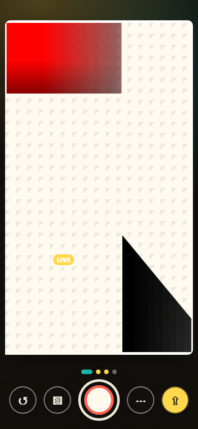

# Instacomic

<p align="center">
  
</p>

<h3 align="center">A phone-first comic camera for fast strips, speech bubbles, stickers, and one-tap export.</h3>

<p align="center">
  <a href="https://instacomic.catcafe.space">Live app</a>
  · PWA
  · React
  · Cloudflare Workers
</p>

<p align="center">
  
</p>

## What it does

Instacomic turns a phone camera into a live comic strip editor. Pick a panel, shoot directly into the strip, layer speech bubbles and stickers over the page, then save the finished comic as a PNG.

## Highlights

- Live camera preview appears inside the selected comic panel.
- A Start button enters the editor and requests fullscreen when the browser allows it.
- Capture advances forward through the layout, then freezes the final photo instead of covering it with the live preview.
- Upload an existing image into the active panel when the camera is not the right source.
- Filled panels support direct photo repositioning: drag to pan and pinch to resize.
- Speech bubble and sticker text edits happen directly on the comic and can be reopened after clicking away.
- Stickers stay on top of the capture surface, drag naturally, rotate and scale with two fingers, and can be thrown into a pop-up trash target.
- Custom layouts are built from draggable rays with large handles, movable endpoints, and two-finger rotate/stretch gestures.
- Style controls cover paper, ink, gutters, borders, corners, captions, and image fit.
- Share renders automatically and falls back to downloading the PNG when native share is unavailable.
- Installable PWA shell with manifest icons and offline app caching.

## Local development

```bash
npm install
npm run dev
```

## Verification

```bash
npm run build
npm run smoke
npm run smoke:photos
npm run smoke:camera
```

The smoke checks exercise the mobile editor flow, inline and repeat sticker text editing, drag/scale/rotate gestures, landscape photo positioning, drag-to-trash deletion, diagonal custom layouts, custom layout deletion, share fallback, manifest loading, and fake-camera capture through the final panel.

## Deploy

The Cloudflare Worker is configured for `instacomic.catcafe.space`.

```bash
npm run deploy
```
