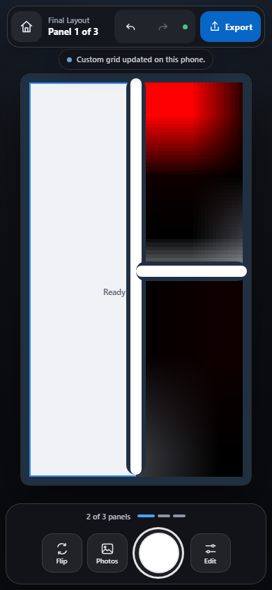

# Instacomic

<p align="center">
  
</p>

<h3 align="center">A phone-first comic camera for fast strips, custom layouts, story video, and one-tap export.</h3>

<p align="center">
  <a href="https://instacomic.catcafe.space">Live app</a>
  · PWA
  · React
  · Cloudflare Workers
</p>

<p align="center">
  
</p>

## What it does

Instacomic turns a phone camera into a live comic strip editor. Pick a panel, shoot or upload photos directly into the strip, style the page, then save a PNG or export a vertical story video.

## Highlights

- Live camera preview appears inside the selected comic panel.
- A Start button enters the editor and requests fullscreen when the browser allows it.
- Capture advances forward through the layout, then freezes the final photo instead of covering it with the live preview.
- Upload an existing image into the active panel when the camera is not the right source.
- Filled panels open a contextual Replace, Fit, Reset, and Remove toolbar without resizing the canvas; tap Done to return to capture controls, or drag, pinch, and twist to position the photo with snap feedback.
- Action-level Undo/Redo and automatic on-device draft recovery protect edits between sessions.
- Custom grids open in a responsive full-screen editor with divider handles, endpoint snapping, persistent border color and thickness controls, and edit-after-save support.
- The grid library renders faithful panel-and-divider previews for both templates and locally saved custom grids.
- Style controls cover paper, border color and thickness, gaps, corners, captions, and image fit, with matching live, PNG, and story-video rendering.
- Story video export renders a sliding panel reveal with duration and speed controls, downloading MP4 output.
- Share renders automatically and falls back to downloading the PNG when native share is unavailable.
- Installable PWA shell with manifest icons and offline app caching.

## Local development

```bash
npm install
npm run dev
```

## Verification

```bash
npm run build
npm run smoke
npm run smoke:installer
npm run smoke:editing
npm run smoke:photos
npm run smoke:camera
npm run smoke:video
```

The smoke checks exercise the mobile editor and installer flows, centered start aspect choices, contextual photo actions, coalesced Undo/Redo history, simultaneous pinch zoom and snap rotation, background autosave, Continue/New draft recovery, short-screen control geometry, uniform editor borders, full-screen snapping custom layouts with thickness controls, persisted custom-grid previews, custom layout deletion, share fallback, manifest loading, fake-camera capture through the final panel, and story video rendering.

## Deploy

The Cloudflare Worker is configured for `instacomic.catcafe.space`.

```bash
npm run deploy
```
