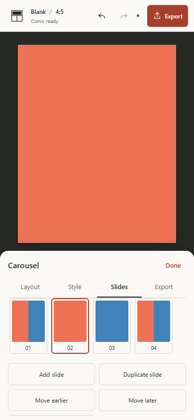
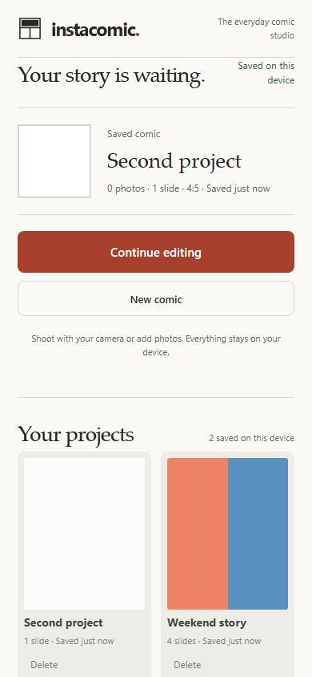
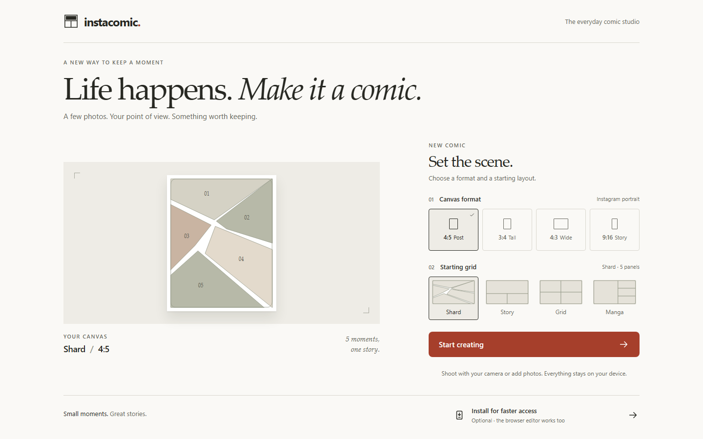

# Instacomic

<p align="center">
  
</p>

<h3 align="center">A photo and carousel studio with blank canvases, custom grids, saved projects, and story video.</h3>

<p align="center">
  <a href="https://instacomic.catcafe.space">Live app</a>
  · PWA
  · React
  · Cloudflare Workers
</p>

<p align="center">
  
</p>

## What it does

Instacomic starts with a blank canvas and a compact grid picker. Add photos, build a multi-slide carousel, or split a panorama into consecutive slides. Projects and original photos are saved locally in the browser.

## Highlights

- Live camera preview appears inside the selected comic panel.
- The full editor works in a browser tab; installation is an optional convenience, and fullscreen is reserved for installed mode.
- New projects begin blank. A four-column bottom gallery offers 27 blank/grid choices while keeping the artwork visible. Camera access starts when requested.
- Capture advances forward through the layout, then freezes the final photo instead of covering it with the live preview.
- Upload an existing image into the active panel when the camera is not the right source.
- Filled panels open a contextual Replace, Fit, Reset, and Remove toolbar without resizing the canvas; tap Done to return to capture controls, or drag, pinch, and twist to position the photo with snap feedback.
- An IndexedDB project library saves named projects, photos, slide order, grids, captions and image transforms. Existing single drafts migrate automatically; starting a new project preserves earlier work. Deletion requires confirmation and retains photos still used by other projects.
- Carousels support up to 20 slides, with live thumbnails, add/duplicate/reorder/remove controls and Undo/Redo. All slides share the selected format.
- Split a photo across 2–5 consecutive slides for a seamless panorama. The original slide stays available.
- Export every slide as a numbered, 1440px-wide PNG in one ZIP. Unzip, then select the images in order when creating an Instagram carousel.
- Projects remain in this browser profile on this device. Clearing site data removes the local library; exported images are independent copies.
- Custom grids use edge-to-edge cuts with angle and position sliders, continuous dragging and two-finger rotation, optional snapping, and gesture-level Undo/Redo. A compact swipeable dock groups Dividers, Adjust, Style, Border, Photos, Caption, and Details controls without shifting the canvas. Every page fits the same 224px drawer, keeping photos and live changes visible.
- The grid editor previews stored photos with their existing crop, fit, and rotation, using the same panel mapping and image placement as the main editor. Cancel leaves the original composition untouched.
- Dividers use a single solid color and width. The outside border has its own toggle and width, using the same line color. Thin editing guides and subtle endpoint cues with 44px touch targets do not appear in exports. Existing saved segments retain their geometry until explicitly extended; saved-grid updates can also be undone from the main editor.
- A consistent graphite workspace and warm editing sheets carry through setup, capture, grid design, and export. Clean, Paper, and Bold presets provide one-tap appearance starting points.
- The grid library renders faithful panel-and-divider previews for both templates and locally saved custom grids.
- Layout, Appearance, Slides, and Export share an accessible, keyboard-navigable sheet. Layout and Slides use compact bottom drawers with space reserved for the live canvas.
- Custom canvas styling lives inside the grid editor: line color and width, paper, corners, captions, image fit, and presets. Changes are staged until Save or Update; Cancel leaves the comic unchanged. The separate Style sheet remains available for built-in templates.
- One Export flow presents image completeness, PNG sharing, video settings, render progress, and explicit Download/Share actions; video rendering never auto-downloads.
- The responsive canvas preserves its exact format on short phones, tablets, desktop, and landscape without rotating the app shell.
- Installable PWA shell with manifest icons and offline app caching.

## Carousels and saved projects

<p align="center">
  
  
</p>

## Design system



The editorial studio covers setup, capture, photo editing, custom grids, appearance, and export. Desktop has direct Layout/Style access and panel navigation; mobile uses contextual bottom tools. See [design foundations and component ownership](docs/design-system.md).

## Local development

```bash
npm install
npm run dev
```

## Verification

```bash
npm run build
npm run smoke:blank
npm run smoke:carousel
npm run smoke:migration
npm run smoke
npm run smoke:installer
npm run smoke:editing
npm run smoke:save
npm run smoke:photos
npm run smoke:camera
npm run smoke:video
npm run smoke:ux
npm run smoke:grid
npm run smoke:studio
node scripts/canvas-style-smoke.mjs
```

The smoke checks exercise browser-first setup and optional installation, exact responsive canvas geometry, labelled export flows, contextual photo actions, coalesced Undo/Redo history, simultaneous pinch zoom and snap rotation, background autosave, Home/Continue/New recovery, photo-safe custom-grid saves, accessible modal and tab behavior, keyboard and pointer grid editing, safe custom-grid deletion/discard, live/export border parity, fake-camera capture through the final panel, and explicit story-video download.

## Deploy

The Cloudflare Worker is configured for `instacomic.catcafe.space`.

```bash
npm run deploy
```
