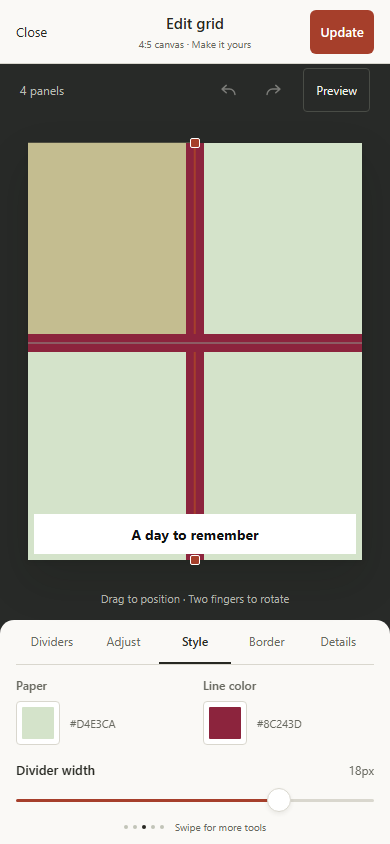

# Instacomic

<p align="center">
  
</p>

<h3 align="center">A phone-first comic camera for fast strips, custom layouts, story video, and one-tap export.</h3>

<p align="center">
  <a href="https://instacomic.catcafe.space">Live app</a>
  · PWA
  · React
  · Cloudflare Workers
</p>

<p align="center">
  
</p>

## What it does

Instacomic turns a phone camera into a live comic strip editor. Pick a panel, shoot or upload photos directly into the strip, style the page, then save a PNG or export a vertical story video.

## Highlights

- Live camera preview appears inside the selected comic panel.
- The full editor works in a browser tab; installation is an optional convenience, and fullscreen is reserved for installed mode.
- New-comic setup combines canvas format and a visual starting-grid choice, both of which remain editable later.
- Capture advances forward through the layout, then freezes the final photo instead of covering it with the live preview.
- Upload an existing image into the active panel when the camera is not the right source.
- Filled panels open a contextual Replace, Fit, Reset, and Remove toolbar without resizing the canvas; tap Done to return to capture controls, or drag, pinch, and twist to position the photo with snap feedback.
- Action-level Undo/Redo and automatic on-device draft recovery protect edits between sessions.
- Custom grids use edge-to-edge cuts with angle and position sliders, continuous dragging and two-finger rotation, optional snapping, and gesture-level Undo/Redo. A compact swipeable dock groups Dividers, Adjust, Style, Outline, and Details controls without shifting the canvas.
- The grid editor previews stored photos with their existing crop, fit, and rotation, using the same panel mapping and image placement as the main editor. Cancel leaves the original composition untouched.
- Spacing is independent of optional panel outlines, which start off. Thin editing guides and invisible 44px touch targets do not appear in exports. Existing saved segments retain their geometry until explicitly extended; saved-grid updates can also be undone from the main editor.
- A consistent graphite workspace and warm editing sheets carry through setup, capture, grid design, and export. Clean, Paper, and Bold presets provide one-tap appearance starting points.
- The grid library renders faithful panel-and-divider previews for both templates and locally saved custom grids.
- Layout, Appearance, and Export live in one accessible sheet that keeps the canvas geometry stable and remains keyboard navigable.
- Style controls cover paper, stroke color and thickness, gaps, corners, captions, and image fit, with matching live, PNG, and story-video rendering.
- One Export flow presents image completeness, PNG sharing, video settings, render progress, and explicit Download/Share actions; video rendering never auto-downloads.
- The responsive canvas preserves its exact format on short phones, tablets, desktop, and landscape without rotating the app shell.
- Installable PWA shell with manifest icons and offline app caching.

## Local development

```bash
npm install
npm run dev
```

## Verification

```bash
npm run build
npm run smoke
npm run smoke:installer
npm run smoke:editing
npm run smoke:save
npm run smoke:photos
npm run smoke:camera
npm run smoke:video
npm run smoke:ux
npm run smoke:grid
```

The smoke checks exercise browser-first setup and optional installation, exact responsive canvas geometry, labelled export flows, contextual photo actions, coalesced Undo/Redo history, simultaneous pinch zoom and snap rotation, background autosave, Home/Continue/New recovery, photo-safe custom-grid saves, accessible modal and tab behavior, keyboard and pointer grid editing, safe custom-grid deletion/discard, live/export border parity, fake-camera capture through the final panel, and explicit story-video download.

## Deploy

The Cloudflare Worker is configured for `instacomic.catcafe.space`.

```bash
npm run deploy
```
